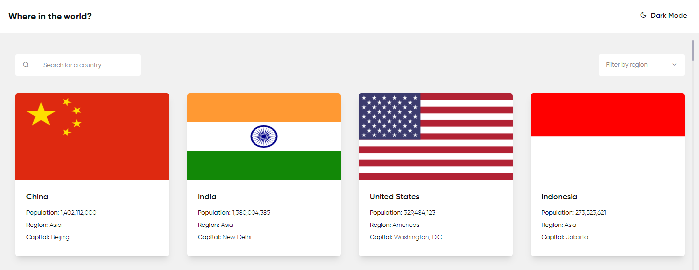

<div style="text-align: center;">
  <br />
  <br />
  <h1>Countries List Project</h1>
  <div style="text-align: center">
    <h3><a href="https://alibaba-coding-challenge.netlify.app/" target="_blank">Demo</a></h3>
  </div>
  <div style="text-align: center">
    <h2>Alibaba Coding Challenge (Frontend - Nuxt.js)</h2>
  </div>
  
  <p>This is project about world wide countries and some stats about them, and you can see details such as <strong>population, capital and etc...</strong> </p>
</div>

<br>
<br>



<br>
<br>

## Project Overview

The **Country List** project built with [Nuxt 3](https://nuxt.com/) And there are some cool technologies such as TailwindCSS, VueUse, Pinia, Vitest that i used it also provides a simple deployment workflow with Docker.

### Core Concepts

#### Api

In these days i use VueUse composable's in all project, and i decide to use `useFetch` composable for api layer, there some async function that will return a promise of server response.

#### Components

All of the components is has own unit test suit that covers all component functionalities and I used typescript and composition api for logic section.

**AppButton**

This component is a button component that have two properties that will control styles of the button _size_ and _flat_.
The `size` property take some string values like md, sm, lg that can control button width and height.
The `flat` property is a boolean property and if you set it to `true` it will remove all `box-shadow` and `background` properties.
Also our button has two slots `append` and `prepend` that you can add icons or every you want and it will show them before and after button text.

**CountryCard**

The CountryCard component takes some information about the countries such as `population`, `capital`, etc... and displays them inside of itself.

**AppDropdown**

For having dropdown I created a component that able to show a list of items with selecting ability and it has custom two-way data binding (v-model).
Also you can use it in case of select elements , for this you have pass name, keyName properties with object key name like example below:

```js
const items : { [key : string] : string}[] = [
  {
    name: 'Mahdi',
    age: 23,
  }
  .
  .
  .
]

keyName: 'name'
name: 'name'
```

**AppHeader**

The header is not complicated, it has two elements a button for **toggling application color scheme** and a heading as logo.

**AppInput**

The AppInput component, is simple and handy input component can meet you needs. all you need to know about it is some explanation about props and slots and thats it.
The defined **slots** is similar with AppDropdown and AppButton, append and prepend.
What about **props**, `placeholder`, `type` and `id` They don't need to explain and the `size` property specify the input size.

#### Layouts

Due to the project scale one layout is enough, so I create one for both mobile and desktop versions.
and you can find logic of changing color scheme inside it.

#### Pages

**Index.vue**

Index.vue is list of countries that we are showing, i use `useHead` for meta configurations and we are calling some api from our pinia store that will save our server responses inside itself. there one point about the images that is all of them loading in lazy-mode.

**[id].vue**

[id].vue is country detail page that have a back button and more data about the country such as border countries.
you might know that i use complex data mapping with [lodash](https://lodash.com/) inside `getters` of pinia store and then i use them as `ref` inside page.

#### Plugins

There of plugin and that's for error handling.

#### Store (Pinia)

The most complex area of the project, `app-store.ts` file is my main store file that is handling api calls, storing response data and data mutation for component.

#### Types

Because of I used typescript (i love it), for more code safety I write some type for data that I using in components or pinia store.

## 🚀 Setup

In your terminal, install all node dependencies:

```bash
cd alibaba-coding-challenge
npm install
```

<br>

## Development Server

Build the application for development environment:

```bash
npm run dev
```

## Running Tests

Make sure all of the components works as we expect:

```bash
npm run test
```

## Production

Build the application for production:

```bash
npm run build
```

Locally preview production build:

```bash
npm run preview
```
